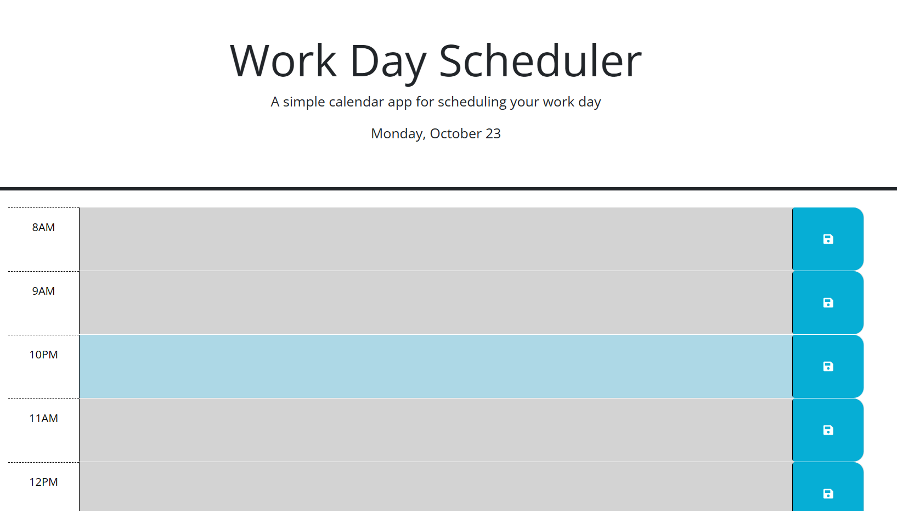

# Work Day Scheduler

## Task

Create a simple calendar application that allows a user to save events for each hour of a typical working day (9am&ndash;5pm) by modifying starter code. This app will run in the browser and feature dynamically updated HTML and CSS powered by jQuery.

## User Story

```md
AS AN employee with a busy schedule
I WANT to add important events to a daily planner
SO THAT I can manage my time effectively
```
## What you will get
You wil find a wokring schedule to get you motivated to stay organized and up to date day by day. 



https://github.com/KKBellew/workday-schedule.git